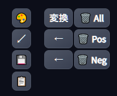

# uiTweaks txt2img prompt controll btn

- this is script/extension for [Stable Diffusion Web UI by AUTOMATIC1111](https://github.com/AUTOMATIC1111/stable-diffusion-webui).

## Features

- txt2img 画面に、ボタンを追加

### 変換
  - NovelAI 形式から WebUI 形式へ変換します
  - 変換コード [https://rentry.org/43zdr](https://rentry.org/43zdr)

### 履歴
- 左矢印(上側): 通常プロンプトを前の履歴へ戻す
- 左矢印(下側): ネガティブプロンプトを前の履歴へ戻す

### Prompt 削除
- 🗑 All: prompt と negative prompt の両方を消す (履歴に残ります
- 🗑 Pos: 通常prompt のみ消す (履歴に残ります
- 🗑 Neg: negative prompt のみ消す (履歴に残ります

## 設定

- 履歴数は 10
  - 変更する場合はスクリプト内変更

## Install

- with Extension tab
  - Extension tab にて、URL から導入

- direct
  - put .js file into javascript folder.

## メモ

- 変換が失敗することがある
  - ネストが深い？
  - {} カッコの対応が不完全？

## Thanks

- [https://rentry.org/43zdr](https://rentry.org/43zdr)
